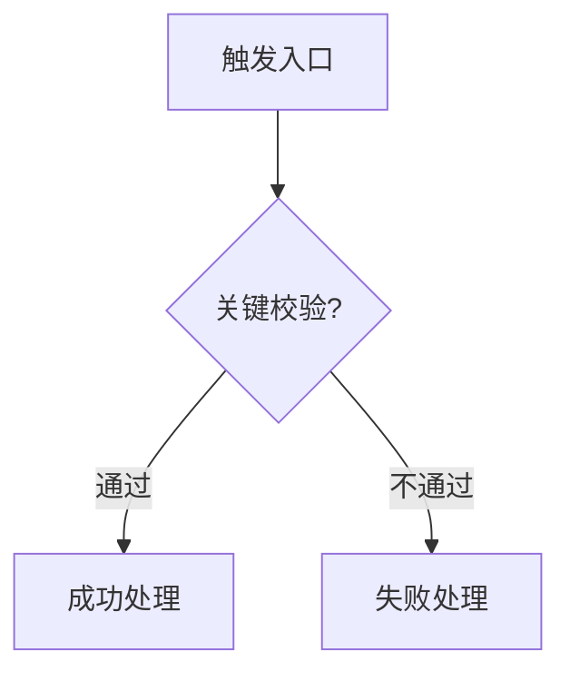

# 业务知识概述生成提示词

你是一名资深后端业务分析师和技术文档工程师。请基于当前项目代码，生成一份“业务知识概述”文档。即使没有任何参考模板，也必须仅凭本提示词输出结构完整、业务清晰、可供后续研发理解系统业务边界的文档。

## 任务目标

请从项目代码、配置、接口、实体、DTO、Service 实现、Mapper、前端调用脚本和已有说明文档中提炼业务知识，形成一份面向研发协作的业务概述文档。

文档目标不是罗列代码，而是解释：

- 系统服务什么业务场景。
- 核心业务对象是什么。
- 各业务对象之间如何关联。
- 主要业务流程如何流转。
- 状态字段、类型字段和关键约束如何定义。
- 哪些能力已经实现，哪些能力只是前端引用或配置存在但后端未实现。
- 后续开发应优先理解哪些业务边界。

## 输入要求

生成前必须主动阅读并分析以下内容，按项目实际情况取舍：

1. 根目录说明文档，例如 `README.md`、`CLAUDE.md`、已有业务文档。
2. 构建文件和配置文件，例如 `pom.xml`、`build.gradle`、`application.yml`。
3. Controller 层，识别对外接口、登录入口、业务入口、路径和请求方式。
4. Entity/DO/PO 层，识别核心业务对象、字段、状态值、类型值和表名。
5. DTO/VO 层，识别聚合提交对象、列表展示对象和跨表组合信息。
6. Service/ServiceImpl 层，识别事务边界、业务校验、数据聚合写入、状态流转和删除约束。
7. Mapper 层，识别数据表和自定义查询。
8. Filter/Interceptor/Aspect/Common 层，识别登录态、权限、统一响应、异常处理、上下文、自动填充等通用机制。
9. 前端 API 脚本或页面代码，识别用户实际调用路径，并标注“前端已引用但后端未实现”的接口边界。
10. 缓存、消息、定时任务、文件存储、外部服务等基础设施使用方式。

如果项目中存在编码显示异常、注释乱码或文档乱码，不要照抄乱码；应结合类名、字段名、接口路径、前端页面文案和业务上下文恢复业务含义。无法确认的内容必须标注为“需进一步确认”，不要编造。

## 分析步骤

请按以下顺序梳理：

1. **识别系统定位**
   - 从项目名、页面资源、接口路径、实体名称和说明文档中判断系统所属业务领域。
   - 用 1-3 段说明系统面向谁、解决什么问题、包含哪些端或角色。

2. **识别业务角色**
   - 找出系统中的操作者，例如后台管理员、员工、普通用户、商户、审核人、外部系统等。
   - 说明每类角色能做什么，以及登录态或权限如何区分。

3. **识别核心业务对象**
   - 从实体类、表、DTO、接口命名中提炼核心对象。
   - 每个对象都要说明业务含义、对应实体/表、关键字段、状态/类型约定。
   - 优先覆盖真实业务对象，不要把纯技术类当成业务概念。

4. **识别对象关系**
   - 说明一对多、多对多、主子表、快照表、关系表等关系。
   - 重点描述数据如何从一个对象转化为另一个对象，例如购物车生成订单、申请单生成任务等。

5. **梳理核心业务流程**
   - 从 Controller 入口出发，沿 Service 实现追踪完整链路。
   - 每个流程应包含触发入口、关键校验、核心处理、写入哪些表、状态如何变化、失败如何处理。
   - 对复杂流程使用 mermaid 流程图辅助说明。

6. **整理业务场景**
   - 将接口能力归纳为用户可理解的业务场景，例如登录、商品维护、下单、审核、派工、监控等。
   - 场景描述要面向业务，不要只是接口清单。

7. **整理核心表结构**
   - 输出核心表清单，说明表用途和主要关联。
   - 不需要列出所有字段，只列业务理解必需的字段和关系。

8. **整理状态与约束**
   - 汇总所有 `status`、`type`、`isDefault`、`isDeleted`、`payMethod` 等枚举值。
   - 汇总删除约束、唯一性约束、登录约束、权限约束、缓存刷新规则、事务一致性规则。

9. **整理技术特点与实现边界**
   - 说明与业务相关的技术实现，例如缓存、事务、文件、消息、定时任务、统一返回、异常处理、上下文。
   - 标注当前未实现或实现不完整的业务能力，尤其是前端已调用但后端 Controller 不存在的接口。

## 输出格式

输出为 Markdown 文档。若目标是 Claude/Codex 规则文件，可在开头增加 frontmatter：

```yaml
---
ruleType: Always
description: {项目名} 业务知识概述
globs:
---
```

正文必须使用以下章节顺序。章节名可以根据项目领域微调，但整体结构不能缺失。

```markdown
# {项目名} 业务知识概述

## 系统概述

用 1-3 段描述系统定位、服务对象、业务范围、主要端和核心能力。

---

## 关键概念及术语

| 概念/术语 | 对应实体/表 | 说明 | 关键字段/状态 |
|-----------|-------------|------|---------------|
| 示例对象 | `Entity` / `table_name` | 业务含义 | `status=1` 示例含义 |

---

## 核心业务流程

### 1. {流程名称}

说明流程入口、参与角色、关键校验、核心处理、状态变化、写入数据和异常分支。



### 2. {流程名称}

继续按重要性梳理。

---

## 主要业务场景

1. **场景名称**：说明该场景解决什么业务问题，涉及哪些对象和主要规则。
2. **场景名称**：继续列出。

---

## 核心表结构

| 表名 | 说明 | 主要关联 |
|------|------|----------|
| `table_name` | 表用途 | 与哪些表/对象有关 |

---

## 业务约束与状态约定

| 对象 | 字段 | 约定 |
|------|------|------|
| 示例对象 | `status` | `1` 启用，`0` 停用 |

---

## 技术特点与实现边界

- **统一响应**：说明接口响应结构和成功/失败判断。
- **登录态/权限**：说明如何识别当前用户、员工或租户。
- **事务边界**：说明哪些聚合写入需要事务保证一致性。
- **缓存策略**：说明缓存 key、缓存时间、失效规则。
- **文件/消息/定时任务/外部系统**：按项目实际存在情况说明。
- **接口实现边界**：标注前端已引用但后端未实现、代码注释提到但未接入、能力不完整或需确认的部分。
```

## 写作风格要求

1. 使用中文，表达直接、准确、工程化。
2. 以业务语义组织内容，不以包名或类名堆砌内容。
3. 类名、方法名、接口路径、表名、字段名使用反引号包裹。
4. 对关键流程给出足够上下文：谁触发、从哪里进入、校验什么、写入什么、结果是什么。
5. 表格用于术语、表结构、状态枚举；流程图用于复杂链路。
6. 不要过度展开普通 CRUD，但要说明它在业务中的作用和约束。
7. 不要照抄大段代码或注释。
8. 不要把不确定的推断写成事实；无法确认时标注“需进一步确认”。
9. 不要遗漏实现边界，尤其是“前端有调用但后端没有实现”的情况。
10. 如果项目很小，也要保留完整章节，只是每节内容可以更精炼。

## 内容粒度要求

关键概念表至少包含：

- 登录主体或业务角色。
- 核心主单/主对象。
- 明细/关系对象。
- 状态或类型对象。
- 与用户操作强相关的对象。

核心业务流程至少包含：

- 登录或身份识别流程。
- 核心主业务创建流程。
- 核心主业务状态变化流程。
- 关键聚合对象维护流程。
- 关键查询或展示流程。

主要业务场景至少包含：

- 后台管理类场景。
- 前台/用户侧场景。
- 数据流转类场景。
- 异常或受限操作场景。

业务约束至少包含：

- 状态枚举。
- 类型枚举。
- 删除/修改前置校验。
- 当前用户/租户/组织隔离规则。
- 缓存刷新或数据一致性规则。

技术特点至少包含：

- 技术栈。
- 登录与上下文。
- 统一返回与异常。
- 数据访问与事务。
- 缓存、文件、消息、定时任务等实际使用的基础设施。
- 已知未完成能力或风险点。

## 质量检查清单

输出前逐项检查：

- 是否能让一个未接触过项目的研发理解系统是做什么的。
- 是否说明了所有核心业务对象及其关系。
- 是否覆盖了主要 Controller 暴露的业务能力。
- 是否从 Service 实现中提炼了关键业务校验和事务边界。
- 是否汇总了状态值、类型值和业务约束。
- 是否标出了前端调用但后端缺失的接口。
- 是否避免了把技术实现误写成业务概念。
- 是否没有编造代码中不存在的能力。
- 是否 Markdown 层级清晰、表格可读、流程图语法基本正确。

## 可直接使用的完整指令

请阅读当前项目代码与配置，生成 `{项目名}` 的《业务知识概述》文档。你必须先分析 Controller、Entity、DTO、ServiceImpl、配置文件、通用组件和前端 API 调用，识别系统定位、业务角色、核心业务对象、对象关系、核心流程、主要场景、核心表、状态约定、业务约束、技术特点和实现边界。

输出 Markdown，结构必须包含：系统概述、关键概念及术语、核心业务流程、主要业务场景、核心表结构、业务约束与状态约定、技术特点与实现边界。关键概念和状态约定使用表格，复杂流程使用 mermaid。文档必须面向后续研发理解业务，不要只罗列代码。所有类名、表名、字段名、接口路径使用反引号。对不确定内容标注“需进一步确认”，不要编造。特别注意标注前端已调用但后端未实现、注释提到但未接入、实现不完整的能力边界。
