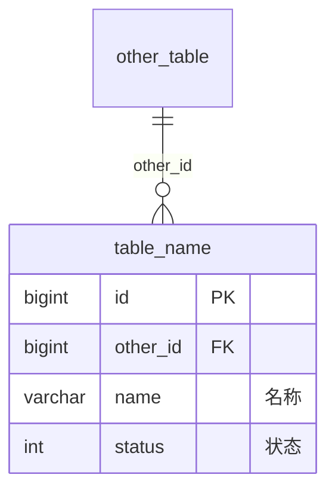

# 数据模型文档生成提示词

你是一名资深后端数据建模工程师和技术文档工程师。请基于当前项目代码，生成一份“数据模型”文档。即使没有任何参考模板，也必须仅凭本提示词输出结构完整、关系清晰、可供后续研发理解和维护数据库模型的文档。

## 任务目标

请从项目代码、实体类、DTO、Mapper、Service 实现、配置文件和已有文档中提炼数据模型，形成一份面向研发协作的数据模型文档。

文档目标不是简单罗列实体字段，而是说明：

- 系统有哪些核心数据域。
- 每个业务模块包含哪些表。
- 每张表对应哪个实体，承载什么业务含义。
- 表与表之间如何关联。
- 主表、子表、关系表、快照表如何划分。
- 聚合写入和状态变化涉及哪些表。
- 通用字段、逻辑删除、主键策略、字段映射等基础规则如何约定。
- 哪些结构是从代码推导，哪些来自真实 DDL。

## 输入要求

生成前必须主动阅读并分析以下内容：

1. 数据库脚本：`*.sql`、`*.ddl`、迁移脚本、建表脚本。如果存在真实 DDL，应优先以 DDL 为准。
2. 配置文件：`application.yml`、`application.properties`、MyBatis/MyBatis-Plus 配置，识别数据库名、主键策略、逻辑删除、字段映射、分页插件等。
3. Entity/DO/PO 类：识别表名、字段名、Java 类型、注释、状态枚举、公共字段。
4. 注解：识别 `@TableName`、`@TableId`、`@TableField`、`@TableLogic`、`@Id`、`@Column` 等映射信息。
5. DTO/VO 类：识别聚合模型、展示字段、跨表组合字段、主子表提交结构。
6. Mapper/XML：识别真实表名、自定义 SQL、联表关系、查询字段和索引使用倾向。
7. Service/ServiceImpl：识别业务外键关系、聚合写入、删除约束、状态流转、缓存刷新和事务边界。
8. Controller/前端 API：辅助识别用户实际操作的数据流转。
9. 已有业务文档：用于校正业务含义，但不得覆盖代码事实。

如果项目没有 SQL 脚本，必须明确说明“表结构基于实体类和 ORM 配置推导，实际库结构以数据库为准”。不要编造字段长度、索引和物理外键；无法确认时标注“需进一步确认”。

## 分析步骤

1. **识别数据库与 ORM 基础规则**
   - 数据库名、连接信息。
   - 表名映射规则，例如驼峰转下划线。
   - 主键生成策略。
   - 逻辑删除字段和值。
   - 公共字段自动填充规则。

2. **划分数据模块**
   - 按业务域划分模块，而不是按包名机械分组。
   - 示例：账户与权限、商品主数据、订单交易、审批流程、任务调度、配置字典等。
   - 每个模块说明承载的业务范围。

3. **生成表清单**
   - 每张表列出所属领域、数据库、表名、对应实体、描述、说明。
   - 区分主表、子表、关系表、历史表、配置表、快照表。

4. **绘制 ER 图**
   - 使用 Mermaid `erDiagram`。
   - 只放核心字段：主键、关键外键、状态字段、业务编号、名称字段。
   - 使用业务外键关系，即使数据库没有物理外键，也可以标注为业务关联。

5. **整理表结构**
   - 如果有 DDL，输出关键建表 SQL 或字段表。
   - 如果没有 DDL，输出“基于实体推导的表结构”，使用字段表，不要伪造完整 SQL。
   - 每张表至少包含：字段名、Java 类型或数据库类型、说明、关键约束/规则。

6. **梳理模块间关系**
   - 说明表之间通过哪些字段关联。
   - 说明哪些字段是冗余快照字段。
   - 说明数据如何从一个模块流转到另一个模块。

7. **梳理 DTO 与聚合模型**
   - 说明 DTO 继承或包含哪些实体。
   - 说明新增、修改、查询时涉及哪些表。
   - 说明主子表保存顺序和事务边界。

8. **梳理关键数据规则**
   - 主键生成。
   - 逻辑删除。
   - 公共字段填充。
   - 删除前校验。
   - 唯一性或业务唯一性。
   - 缓存失效。
   - 下单快照、历史表、版本表等数据保留规则。

9. **梳理状态与类型枚举**
   - 汇总所有 `status`、`type`、`enabledFlag`、`isDeleted`、`payMethod` 等字段。
   - 写清楚取值和含义。

10. **写建模注意事项**
    - 明确不确定项。
    - 明确实际库与代码推导的差异风险。
    - 提醒改模型时需要同步修改哪些层。

## 输出格式

输出为 Markdown 文档。若目标文档用于规则目录，建议添加 frontmatter：

```yaml
---
ruleType: Model Request
description: {项目名} 数据模型概述
globs:
---
```

正文必须使用以下结构：

```markdown
# {项目名} 数据模型

> 说明：如果没有 DDL，说明本文档基于代码推导；实际库结构以数据库为准。

## 模块划分概览

- **模块 A**：说明包含哪些数据对象和业务范围。
- **模块 B**：说明包含哪些数据对象和业务范围。

---

# 一、{模块名称}

## 1.1 表清单

| 领域 | 数据库 | 表名 | 对应实体 | 描述 | 说明 |
|------|--------|------|----------|------|------|
| 示例领域 | `db_name` | `table_name` | `EntityName` | 表用途 | 主表/子表/关系表 |

## 1.2 ER 图



## 1.3 表结构

#### table_name - 表中文名

| 字段名 | Java 类型/数据库类型 | 说明 | 关键约束/规则 |
|--------|----------------------|------|---------------|
| `id` | `Long` | 主键 | 主键生成策略 |

---

# 二、{模块名称}

继续按模块输出。

---

# 模块间关系

使用 Mermaid ER 图或列表说明跨模块关系。

---

# DTO 与聚合模型

| DTO | 继承/包含 | 用途 | 数据写入规则 |
|-----|-----------|------|--------------|
| `ExampleDTO` | 包含 `List<Detail>` | 新增主子表 | 先写主表，再写子表 |

---

# 关键数据规则

| 规则 | 涉及表 | 说明 |
|------|--------|------|
| 主键生成 | 全部表 | 规则说明 |

---

# 状态与类型枚举

| 对象 | 字段 | 取值 |
|------|------|------|
| 示例对象 | `status` | `1` 启用，`0` 停用 |

---

# 建模注意事项

1. 说明不确定项。
2. 说明改表时需要同步修改的代码层。
```

## 写作风格要求

1. 使用中文，表达直接、准确、工程化。
2. 类名、表名、字段名、DTO 名称、配置项使用反引号。
3. 不要把纯工具类写成数据模型。
4. 不要照抄乱码注释。
5. 不要在没有 DDL 的情况下伪造字段长度、索引或物理外键。
6. ER 图只保留核心字段，不要把所有字段都塞进去。
7. 字段表要覆盖实体中的全部业务字段和公共字段。
8. 对主子表、关系表、快照字段要明确说明。
9. 对删除保护、状态约束、逻辑删除、缓存刷新等业务数据规则要单独总结。
10. 如果项目很小，也要保留完整章节，只是每节可以更精炼。

## 内容粒度要求

表清单至少覆盖：

- 所有 Entity 对应的表。
- 关系表。
- 历史表或快照表。
- 配置表。
- 用户/组织/权限相关表。

表结构至少包含：

- 主键字段。
- 业务唯一字段或业务编号字段。
- 外键/业务关联字段。
- 状态/类型字段。
- 金额/数量/时间字段。
- 公共审计字段。
- 逻辑删除字段。

模块间关系至少说明：

- 用户与业务数据的归属关系。
- 主表与明细表的关系。
- 关系表连接的两端。
- 快照字段来源。
- 跨模块数据流转。

关键数据规则至少包含：

- 主键策略。
- 字段映射策略。
- 公共字段填充。
- 逻辑删除。
- 删除前校验。
- 状态与类型枚举。
- 事务边界。
- 缓存或异步数据一致性规则。

## 质量检查清单

输出前逐项检查：

- 是否明确说明数据模型来源是 DDL 还是代码推导。
- 是否覆盖所有实体对应的表。
- 是否区分了主表、子表、关系表、快照表。
- 是否提供了 ER 图。
- 是否说明了核心表之间的关联字段。
- 是否汇总了状态与类型枚举。
- 是否说明了主键、逻辑删除、公共字段填充等基础规则。
- 是否把 DTO 聚合写入关系讲清楚。
- 是否避免编造数据库字段长度、索引和物理外键。
- 是否标注了实际库需进一步确认的内容。

## 可直接使用的完整指令

请阅读当前项目代码，生成 `{项目名}` 的《数据模型》文档。你必须分析数据库配置、SQL/DDL 脚本、Entity、DTO、Mapper、ServiceImpl 和业务代码，按业务模块划分数据域，输出表清单、ER 图、表结构、模块间关系、DTO 与聚合模型、关键数据规则、状态与类型枚举、建模注意事项。如果项目没有 DDL，必须明确说明表结构基于实体和 ORM 配置推导，实际库以数据库为准。不要照抄乱码注释，不要编造字段长度、索引或物理外键，无法确认的内容标注“需进一步确认”。
